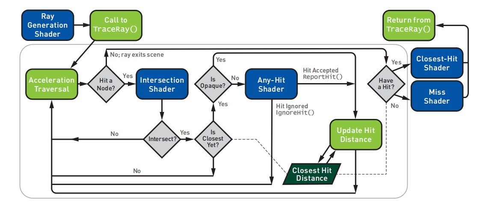

# Ray Tracing Gems

## Abstract
现代的图形APIs如DirectX 12对开发者暴露了更加底层的硬件接口访问和控制，这就经常导致对于初学者看到这种复杂冗长的代码会感到害怕。在这一章，我们希望一步步解密安装和使用DirectX的光线追踪。

## 3.1	介绍
在2018年的游戏开发者大会上，微软宣布了他们的 DirectX Raytracing (DXR)API,这扩展了Directx12的本地光线追踪支持。随着2018年10月份windows10的更新,这个API运行在所有的支持DX12的GPU上，不是使用专用硬件加速就是通过基于计算的软件调用。此功能为DirectX渲染器提供了新选项，从完整的，电影质量的路径跟踪器到更简陋的光线-光栅混合，例如，用光线跟踪替换光栅渲染的阴影或反射。

与所有图形API一样，在深入研究代码之前，一些先决条件非常重要。 本章假设读者了解光线跟踪的基本原理，并参考本书的其他章节，或者其他文本[^ 4,^ 10]了解l 基本原理。此外，我们假定读者熟悉GPU编程；了解光线跟踪shader，具有基本DirectX、Vulkan或OpenGL的经验。如果你有以前使用DirectX 12的经验可能对理解底层的细节有帮助。
## 3.2	概述

GPU编程有三个独立于api的关键部分组成
* （1）GPU设备编程
* （2）CPU主机端设置进程（the CPU host-side setup process）
* （3）主机和设备之间的数据共享。
在我们讨论每一个部分之前，3.3节介绍了重要的软件和硬件的要求，以便开始构建和运行基于DXR的程序。

然后我们讨论每一个核心的部分，3.4，3.5，3.6章节开始介绍如何去编写DXR的shaders.对于DXR的高级着色语言（HLSL）看起来和用c++写的串行的光线追踪器很相似。使用库来抽象主机端的图形API(例如Falcor),甚至初学者都能很快搭建有趣的GPU加速的光线追踪器。在3.1节有一个例子的展示，它是用一个简单的路径追踪器扩展的Falcor来呈现的。  
3.7节提供了主机断DXR的安装过程的概述，并且描述了the mental model驱动新的API。3.8节包括必要的DXR初始化、建立光线加速的必要数据结构和对tracing shaders 的编译。3.9和3.10章分别介绍了新的光线追踪 pipeline state objectsh和 shader tables,他们定义了host和GPU间的数据通信。3.11展示了如何配置和启动光线。最后3.12讨论了对于想要深入研究的读者来说的额外的学习资源。  

DirectX抽象了光线加速结构，与软件渲染器不同，选择此结构是影响性能的关键选择。今天的共识是，边界体积层次结构（BVHs）有着比其他结构更好的特性，因此本章的前半部分将加速结构称为边界体积层次结构（bounding volume hierarchies），即使DirectX不强制要求使用BVH。 第3.8.1节详细说明了加速结构的初始化
## 3.3	开始
想要开始搭建DirectX 光线追踪的应用程序，你需要一些标准工具。DXR近能运行在 Windows 10 RS5(或者更新的)，或者称作1809版本或者2018 10月更新。检查你的windwos 版本通过运行 winver.exe,或者打开Settings → System → About.

在确认了你的操作系统之后，安装并且更新包括DXR的头文件和静态库的windows SDK。这需要 windows 10SDK 10.0.17763.0或更高，这可能叫做windows 10 1809 版本。你需要visual studio 或者其他类似的编译器。不管是专业版还是免费的社区版的Visual studio 2017都可以.
最后，光线追踪要求GPU支持Directx12(检查 dxdiag.exe)。拥有硬件加速的光线追踪对于复杂场景和高分辨率的情况下拥有着更好的表现。在旧的GPU上每个像素跟踪几条射线可能是可行的，特别是当使用简单的场景或较低的分辨率时。由于各种原因，光线追踪要比光栅化的渲染器需要更多的内存。内存较少的硬件可能会表现出糟糕的性能。

## 3.4	 DirectX的光线追踪管线
传统的GPU光栅化管线包含许多开发者可以编写传统的shader去控制图像生成的可编程的阶段。DXR介绍了一种新的光线图元和灵活的光线数据存储（见3.5.1）加上5个新的着色阶段，如图3.2中的简化管道图所示。这些着色器允许发射光线，控制光线/几何交点，并遮挡已识别的命中。




* 1.ray generation shader在管线的一开始，允许开发者使用内置的`TraceRay()`着色函数，确认那个光线将要发射。和传统的计算着色器一样，它在常规的一维、二维或三维样本网格上执行。
* 2.Intersection shaders，定义了对于光线和任意图元相交的计算。它为三角形和光线的相交提供了更好的性能。


* 3.Any-hit shaders[^1]允许可控地丢弃其它有效的交叉点，例如，在纹理查找后忽略alpha遮罩的几何体。
*尽管名称角这个，any-hit shaders每个交叉点不会每一次都运行，主要是出于性能原因。 默认情况下，它们可以运行每条光线的变量，与实现相关的次数。 仔细阅读规范以了解和控制更复杂用例的行为。*

* 4.closest-hit shader在沿每条光线的最近的交叉点处执行。 通常，这会计算交叉点处的颜色，类似于栅格化管道中的像素着色器。
* 5 当光线错过场景中的所有几何图形时，miss shader就会执行。例如，这允许查找环境映射或动态天窗模型。

正如您在介绍性教材[^9]中所发现的那样，请思考右侧的伪代码以获得简单的CPU光线跟踪器。 代码循环输出图像，为每条光线设置方向，遍历加速结构，在重叠的加速结构节点中计算几何交叉，查询这些交叉点是否有效，以及对最终结果进行着色
```
for x, y ∈ image.dims() do
    [1] ray = computeRay(x, y);
    closestHit = null;
    while
    leaf = findBvhLeafNode(ray, scene)
    do
        [2] hit = intersectGeometry(ray,leaf);
        if isCloser(hit, closestHit) then
            if [3] isOpaque(hit) then
                closestHit = hit;
    if closestHit then
        [4] image[x,y] = shade(ray,closestHit);
    else
        [5] image[x,y] = miss(ray);
```

## 3.5	New HLSL Support for DirectX Raytracing

## 3.6	A Simple HLSL Ray Tracing Example

## 3.7	Overview of Host Initialization for DirectX Raytracing

## 3.8	Basic DXR Initialization and Setup

## 3.9	Ray Tracing Pipeline State Objects

## 3.10	Shader Tables

## 3.11	Dispatching Rays

## 3.12	Digging Deeper and Additional Resources

## 3.13	Conclusion

## References
[^1]	Benty,	N.	DirectX	Raytracing	Tutorials.	https://github.com/ NVIDIAGameWorks/DxrTutorials, 2018. Accessed October 25, 2018.

[^2]	Benty, N., Yao, K.-H., Foley, T., Kaplanyan, A. S., Lavelle, C., Wyman, C., and Vijay, A. The Falcor Rendering Framework. https:
//github.com/NVIDIAGameWorks/Falcor, July 2017.

[^3]	Marrs, A. Introduction to DirectX Raytracing. https://github.com/ acmarrs/IntroToDXR, 2018. Accessed October 25, 2018.

[^4]	Marschner, S., and Shirley, P. Fundamentals of Computer Graphics, fourth ed. CRC Press, 2015.

[^5]	Microsoft.	Programming Guide and Reference for HLSL.	https:
//docs.microsoft.com/en-us/windows/desktop/direct3dhlsl/ dx-graphics-hlsl. Accessed October 25, 2018.

[^6]	Microsoft.	D3D12	Raytracing	Samples.	https://github.com/
Microsoft/DirectX-Graphics-Samples/tree/master/Samples/Desktop/ D3D12Raytracing, 2018. Accessed October 25, 2018.

[^7]	Microsoft. DirectX Shader Compiler. https://github.com/Microsoft/ DirectXShaderCompiler, 2018. Accessed October 30, 2018.

[^8]	NVIDIA. DirectX Raytracing Developer Blogs. https://devblogs.nvidia. com/tag/dxr/, 2018. Accessed October 25, 2018.

[^9]	Shirley, P. Ray Tracing in One Weekend. Amazon Digital Services LLC, 2016. https://github.com/petershirley/raytracinginoneweekend.

[^10]	Suffern, K. Ray Tracing from the Ground Up. A K Peters, 2007.

[^11]	Wyman, C. A Gentle Introduction To DirectX Raytracing. http://cwyman. org/code/dxrTutors/dxr_tutors.md.html, 2018.

[^12]	Wyman, C., Hargreaves, S., Shirley, P., and Barre-Brisebois,´ C. Introduction to DirectX Raytracing. SIGGRAPH Courses,
2018.	http://intro-to-dxr.cwyman.org, https://www.youtube.com/ watch?v=Q1cuuepVNoY.
