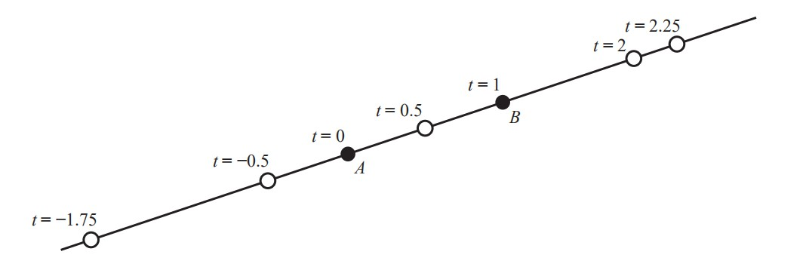
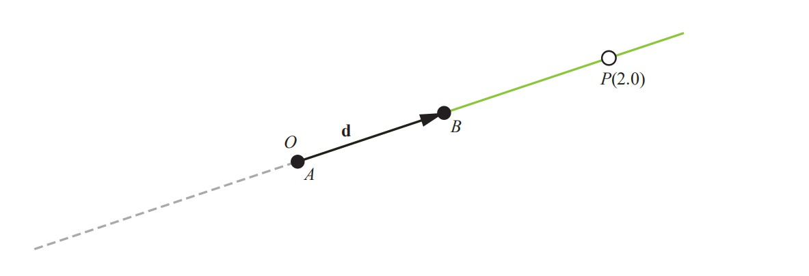
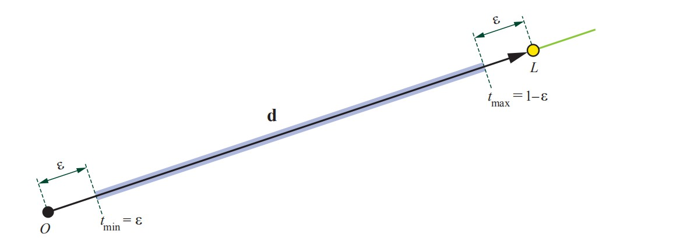

# 什么是光线
## Abstract

我们定义光线，展示如何使用光线间隔，并且演示如何字DirectX Raytracing(DXR)中指定关系光线
## 2.1 光线的数学表示
对于光线追踪，非常重要的计算结构式三维的光线。不论在数学还是光线追踪中，一个光线通常指的式三维的半直线（射线）。通常将光线指定为线上的间隔。对于三维的直线来说没有隐式的方程，类似于二维的线$y=mx+b$,所以，通常我们使用参数形式。在这一章，所有的线，点，和向量都是三维的。
一个参数形式的线可以表示为两个点A,B的加权平均值。

$$P(t)=(1-t)A+tB \tag{2.1}$$






在程序中，我们可能会想到把函数$P(t)$拥有实数输入t,并且返回一个点$P$这种表示方法。对于整条线来说，参数式可以输入任何的实数，$t\in [-\infty,\infty]$,并且，随着t的变化点P沿着线连续移动，如图2.1.为了去实现这个函数，我们需要一种表示点A和B的方式。这里可以使用任何的坐标系，但是几乎都是使用笛卡尔坐标。在APIs和编程语言中，这个表示方法通常是*vec3*或者*float3*并且包含三个实数，x,y,z.相同的直线能够被这条直线上任意两个点所表示。但是悬着不同的点，会改变t的值。

通常我们使用一个点+一个方向向量的形式，而不是两个点。如图2.2，我们能旋转我们的光线方向**d**为$B-A$,并且，我们的原点*O*为A，得到

$$P(t)=O+td$$
由于各种各样的原因，一些程序发现对于计算向量之间的点集来说，限制的**d**为单位向量$\hat{d}$是非常有用的，*normalized*.归一化方向向量的结果是t直接表示距离原点的有符号距离。 更一般地，任何两个t值的差异则是点之间的实际距离

$$||P(t_{1}-P(t_{2})||=|t2-t1| \tag{2.3}$$
对于一般的向量**d**,这个形式需要扩大**d**的长度

$$||P(t_{1}-P(t_{2})||=|t2-t1|||d|| \tag{2.4}$$

## 光线间隔
使用2.2的光线公式，我们想象中光线的画面是一条无限长的半线。然而，在光线追踪中，光线通常伴随着额外的间隔:t值的范围




## 2.3 DXR中的光线
在这个部分，我们展示在 DirectX Raytracing [^ 3]中的光线的定义。在DXR，光线具有下面的结构：
```
    struct RayDesc
    {
        float3 Origin;
        float TMin;
        float3 Direction;
        float TMax;
    };
```
在DXR中处理光线类型的方式不同，其中某个着色器程序与每种不同类型的光线相关联。 要使用DXR中的`TraceRay()`函数跟踪光线，需要`RayDesc`。 `RayDesc::Origin`设置为我们光线的原点O，`RayDesc :: Direction`设置为方向d，并且t-interval（`RayDesc :: TMin`和`RayDesc :: TMax`）也必须初始化。 例如，对于眼睛光线（`RayDesc eyeRay`），我们设置`eyeRay.TMin = 0.0`和`eyeRay.TMax = FLT MAX`，这表示我们对原点前面的所有交点感兴趣。


## 2.4	总结
本章介绍了如何在光线跟踪器中定义和使用光线，并给出了DXR API的光线定义。 这和其他射线追踪系统，如OptiX [^ 1]和Vulkan射线追踪扩展[^ 2]有着微小的变化。 例如，OptiX明确定义了光线类型，例如阴影光线（shadow ray）。 这些系统具有其他共性，例如射线有效载荷（ray payload）的概念。 这是一种数据结构，可由用户定义以携带附加信息以及可由单独的着色器或模块访问和编辑的光线。 这些数据具有特定的应用。 在每个定义光线的渲染系统中，在核心您将找到光线的原点，方向和间隔。

## References
[^ 1]NVIDIA. OptiX 5.1 Programming Guide. http://raytracing-docs.nvidia.com/optix/guide/index.html, Mar. 2018.

[^ 2]Subtil, N. Introduction to Real-Time Ray Tracing with Vulkan.	NVIDIA
Developer Blog, https://devblogs.nvidia.com/vulkan-raytracing/, Oct. 2018.

[^ 3]Wyman, C., Hargreaves, S., Shirley, P., and Barre-Brisebois, C.´ Introduction to DirectX RayTracing. SIGGRAPH Courses, Aug. 2018.
